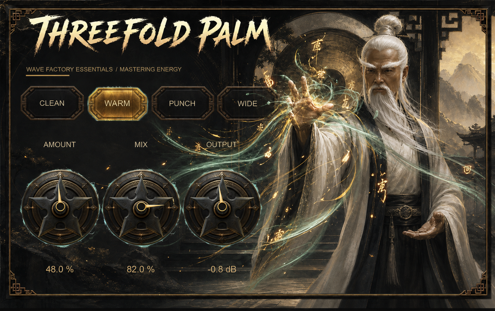
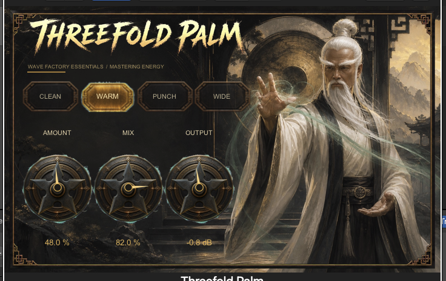

# Wave Factory Essentials

Free, offline audio tools shaped by requests from Wave Factory members. No AI, accounts, telemetry, uploads, or hosted services.



> The hero image establishes the approved Threefold Palm visual direction. The current plugin UI is shown below in Logic Pro.

## Threefold Palm

Threefold Palm is an approachable three-band dynamics, saturation, and tonal-shaping processor for adding controlled energy to a mix, drum bus, or instrument bus.

It divides the signal into low, mid, and high bands, then applies character-specific compression, harmonic drive, and makeup gain. The **Wide** character also adds a restrained stereo-side lift. Parallel mixing and output trim make it practical to audition the processing honestly.



The interface includes an in-plugin **?** guide explaining the processor, Character modes, controls, and a quick-start workflow.

### Character modes

| Character | Sound and purpose |
| --- | --- |
| **Clean** | Balanced, transparent multiband control for subtle cohesion. |
| **Warm** | More low-mid harmonic weight with relaxed dynamics. |
| **Punch** | Transient-forward impact with a quicker recovery. |
| **Wide** | High-band sheen plus controlled stereo expansion on stereo material. |

Selecting a Character also recalls a useful starting point for Amount, Mix, and Output. The knobs immediately update so the preset remains visible and editable.

### Controls

| Control | What it changes |
| --- | --- |
| **Amount** | Strength of the multiband compression, saturation, and selected Character. |
| **Mix** | Parallel blend between the dry and processed signals. |
| **Output** | Post-effect gain trim for level-matching the result against bypass. |

### Quick start

1. Insert Threefold Palm on a mix, drum bus, or instrument bus.
2. Choose the Character closest to the result you want.
3. Raise **Amount** until the source feels energized without losing its shape.
4. Use **Mix** to pull the effect into place.
5. Adjust **Output** so bypassed and processed levels are comparable.

Start subtly on a full mix. **Wide** is most effective on stereo sources.

## Download test builds

Tester packages are available from the [latest GitHub release](https://github.com/carlwelchdesign/wave-factory-essentials/releases/latest).

| Platform | Architectures | Formats |
| --- | --- | --- |
| macOS 11+ | Apple Silicon and Intel | Audio Unit, VST3, CLAP |
| Windows 10/11 | x64 Intel/AMD | VST3, CLAP |

These are pre-release builds:

- macOS bundles are ad-hoc signed but not notarized.
- Windows binaries are unsigned and may produce a security warning.
- The internal bundle filename remains `Goodband` to preserve compatibility with existing sessions; DAWs display **Threefold Palm**.
- Close every DAW before installing or replacing a build.

When reporting a problem, include your operating system, CPU, DAW and version, plugin format, reproduction steps, and whether the problem affects scanning, opening, audio, saved settings, visuals, or CPU use.

## Pitch Trails

Pitch Trails is the second Wave Factory Essentials concept: a pitch-shifting delay and diffusion effect for creating musical movement without drawing automation. It remains an earlier development build and is not included in the Threefold Palm tester release.

## Build from source

### macOS

Requirements:

- CMake 3.25+
- Xcode command-line tools
- Git submodules initialized

```sh
git submodule update --init --recursive
./scripts/configure-macos.sh
cmake --build build/plugins --config Release
ctest --test-dir build/plugins -C Release --output-on-failure
```

The configure script supplies iPlug2 through a temporary path without spaces. This works around an upstream Xcode prefix-header flag issue when the repository lives under `Github Projects`; it does not move or duplicate the dependency.

### Windows

Requirements:

- Windows 10 or 11 x64
- Visual Studio 2022 with **Desktop development with C++**
- CMake 3.25+
- Git submodules initialized

```powershell
git submodule update --init --recursive
cmake -S . -B build/windows -G "Visual Studio 17 2022" -A x64 -DIPLUG_DEPLOY_PLUGINS=OFF -DBUILD_TESTING=ON
cmake --build build/windows --config Release --target Goodband-vst3 Goodband-clap wave_factory_dsp_tests goodband_character_preset_tests
ctest --test-dir build/windows -C Release --output-on-failure
./scripts/package-windows.ps1
```

For fast DSP-only development on either platform:

```sh
cmake -S . -B build/dsp -DWFE_BUILD_PLUGINS=OFF
cmake --build build/dsp
ctest --test-dir build/dsp --output-on-failure
```

## Project boundaries

- Local DSP only: no AI, accounts, telemetry, uploads, or hosted services.
- Separate focused plugins rather than one overloaded interface.
- Framework-independent DSP with thin iPlug2 adapters.
- Honest auditioning through dry/wet controls and bounded parameters.
- Human-reviewed tester releases before broader distribution.

See [the product brief](docs/product-brief.md), [architecture notes](docs/architecture.md), and [roadmap](docs/roadmap.md).
