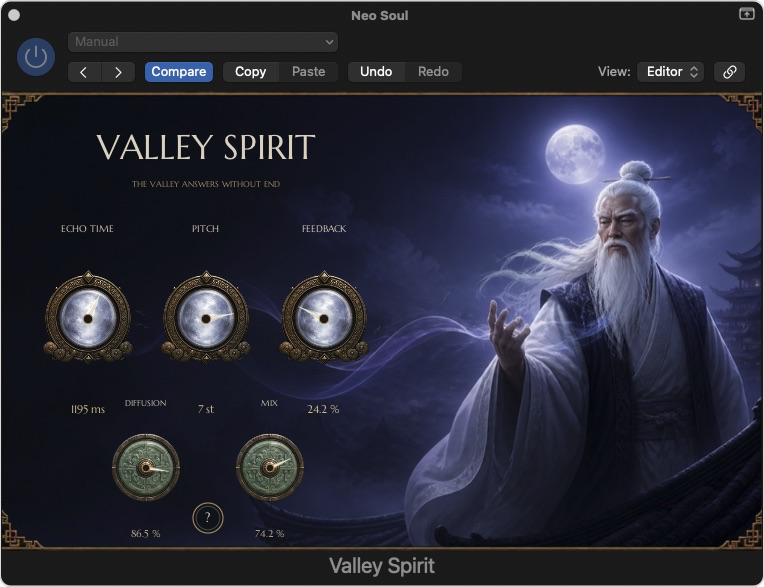
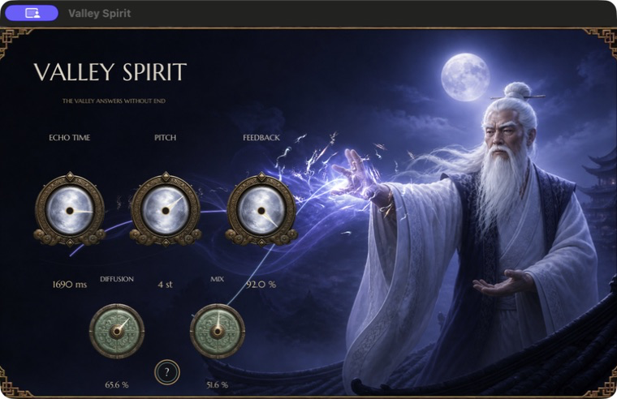

# Threefold Palm + Valley Spirit

Independent, offline audio tools shaped by producer requests. No AI, accounts, telemetry, uploads, or hosted services.

## Tester downloads

| Plug-in | macOS | Windows | Release notes |
| --- | --- | --- | --- |
| **Threefold Palm 0.1.16** | [Universal AU, VST3 and CLAP](https://github.com/carlwelchdesign/wave-factory-essentials/releases/download/v0.1.16/Threefold-Palm-0.1.16-macOS-Universal.zip) | [x64 VST3 and CLAP](https://github.com/carlwelchdesign/wave-factory-essentials/releases/download/v0.1.16/Threefold-Palm-0.1.16-Windows-x64.zip) | [View release](https://github.com/carlwelchdesign/wave-factory-essentials/releases/tag/v0.1.16) |
| **Valley Spirit 0.1.5** | [Apple Silicon AU, VST3 and CLAP](https://github.com/carlwelchdesign/wave-factory-essentials/releases/download/v0.1.16/Valley-Spirit-0.1.5-macOS-Apple-Silicon.zip) | [x64 VST3 and CLAP](https://github.com/carlwelchdesign/wave-factory-essentials/releases/download/v0.1.16/Valley-Spirit-0.1.5-Windows-x64.zip) | [View release](https://github.com/carlwelchdesign/wave-factory-essentials/releases/tag/v0.1.16) |

These are free, pre-release tester builds. Close every DAW before installing or replacing a plug-in.

## Threefold Palm

Threefold Palm is an approachable three-band dynamics, saturation, and tonal-shaping processor for adding controlled energy to a mix, drum bus, or instrument bus.

It divides the signal into low, mid, and high bands, then applies character-specific compression, harmonic drive, and makeup gain. The **Wide** character also adds a restrained stereo-side lift. Parallel mixing and output trim make it practical to audition the processing honestly.

The interface includes an in-plugin **?** guide explaining the processor, Character modes, controls, and a quick-start workflow.

### Character modes

| Character | Sound and purpose |
| --- | --- |
| **Clean** | Balanced, transparent multiband control for subtle cohesion. |
| **Warm** | More low-mid harmonic weight with relaxed dynamics. |
| **Punch** | Transient-forward impact with a quicker recovery. |
| **Wide** | High-band sheen plus controlled stereo expansion on stereo material. |

Selecting a Character also recalls a useful starting point for Amount, Mix, and Output. The knobs immediately update so the preset remains visible and editable.

### Controls

| Control | What it changes |
| --- | --- |
| **Amount** | Strength of the multiband compression, saturation, and selected Character. |
| **Mix** | Parallel blend between the dry and processed signals. |
| **Output** | Post-effect gain trim for level-matching the result against bypass. |

### Quick start

1. Insert Threefold Palm on a mix, drum bus, or instrument bus.
2. Choose the Character closest to the result you want.
3. Raise **Amount** until the source feels energized without losing its shape.
4. Use **Mix** to pull the effect into place.
5. Adjust **Output** so bypassed and processed levels are comparable.

Start subtly on a full mix. **Wide** is most effective on stereo sources.

## Valley Spirit

Valley Spirit is a pitch-shifting delay and diffusion effect that turns a sound into a returning, evolving trail. Its name comes from the Daoist image of the valley: empty but responsive, receiving energy without holding it. The effect receives a sound, lets it travel, and returns it transformed.

| Resting technique | Sensei energy gesture |
| :---: | :---: |
|  |  |

These screenshots come directly from the plug-in renderer. The engraved frame reaches the plug-in edges, while the animated state replaces the Sensei's pose and gathers brighter returning energy around his hand.

### Controls

| Control | What it changes |
| --- | --- |
| **Echo Time** | Distance before the first return. |
| **Pitch** | Raises or lowers every spectral return in semitones. |
| **Feedback** | Length and persistence of the echo path. |
| **Diffusion** | Softens each return into a wider, mist-like cloud. |
| **Mix** | Blends the transformed path with the original source. |

For a fast starting point, set Echo Time, choose a Pitch interval, then raise Feedback until the trail breathes. Use Diffusion to blur distinct repeats into atmosphere and Mix to place the effect behind or around the source. The interface includes an in-plugin **?** manual with the same guidance.

The moonlit interface is alive without covering the controls: textured spirit wisps respond to all five parameters, and the Sensei periodically shifts from a resting stance into an energy-channeling gesture as the returning trails converge around his hand.

Valley Spirit remains deterministic, offline DSP with no AI, accounts, telemetry, or uploads. The internal bundle filename remains `PitchTrails` so existing sessions and host identities stay compatible; DAWs display **Valley Spirit**.

### Quick start

1. Insert Valley Spirit on a vocal, lead, instrument, or effects send.
2. Set **Echo Time** to establish the spacing of the trail.
3. Choose a **Pitch** interval. Try `+7 st` or `+12 st` for rising spirits, or a negative interval for descending shadows.
4. Raise **Feedback** until the trail lasts as long as the phrase needs.
5. Add **Diffusion** to turn distinct repeats into a softer cloud.
6. Use **Mix** to place the transformed trail behind or around the original sound.

Keep Feedback conservative while learning the effect. The DSP bounds feedback internally, but dense pitch-shifted repeats can still become intense.

## Installation and compatibility

| Build | Operating system | Architectures | Formats |
| --- | --- | --- | --- |
| Threefold Palm 0.1.16 | macOS 11+ | Apple Silicon and Intel | Audio Unit, VST3, CLAP |
| Threefold Palm 0.1.16 | Windows 10/11 | x64 Intel/AMD | VST3, CLAP |
| Valley Spirit 0.1.5 | macOS 11+ | Apple Silicon | Audio Unit, VST3, CLAP |
| Valley Spirit 0.1.5 | Windows 10/11 | x64 Intel/AMD | VST3, CLAP |

Each ZIP includes installation instructions. The macOS bundles are ad-hoc signed but not notarized. The Windows binaries are unsigned and may produce a security warning.

The internal filenames remain `Goodband` for Threefold Palm and `PitchTrails` for Valley Spirit. This preserves compatibility with existing sessions even though DAWs show the finished product names.

When reporting a problem, include your operating system, CPU, DAW and version, plug-in format, reproduction steps, and whether the problem affects scanning, opening, audio, saved settings, visuals, or CPU use.

## Build from source

### macOS

Requirements:

- CMake 3.25+
- Xcode command-line tools
- Git submodules initialized

```sh
git submodule update --init --recursive
./scripts/configure-macos.sh
cmake --build build/plugins --config Release
ctest --test-dir build/plugins -C Release --output-on-failure
```

The configure script supplies iPlug2 through a temporary path without spaces. This works around an upstream Xcode prefix-header flag issue when the repository lives under `Github Projects`; it does not move or duplicate the dependency.

### Windows

Requirements:

- Windows 10 or 11 x64
- Visual Studio 2022 with **Desktop development with C++**
- CMake 3.25+
- Git submodules initialized

```powershell
git submodule update --init --recursive
cmake -S . -B build/windows -G "Visual Studio 17 2022" -A x64 -DIPLUG_DEPLOY_PLUGINS=OFF -DBUILD_TESTING=ON
cmake --build build/windows --config Release --target Goodband-vst3 Goodband-clap PitchTrails-vst3 PitchTrails-clap wave_factory_dsp_tests goodband_character_preset_tests
ctest --test-dir build/windows -C Release --output-on-failure
./scripts/package-windows.ps1
```

For fast DSP-only development on either platform:

```sh
cmake -S . -B build/dsp -DWFE_BUILD_PLUGINS=OFF
cmake --build build/dsp
ctest --test-dir build/dsp --output-on-failure
```

## Project boundaries

- Local DSP only: no AI, accounts, telemetry, uploads, or hosted services.
- Separate focused plugins rather than one overloaded interface.
- Framework-independent DSP with thin iPlug2 adapters.
- Honest auditioning through dry/wet controls and bounded parameters.
- Human-reviewed tester releases before broader distribution.

See [the product brief](docs/product-brief.md), [architecture notes](docs/architecture.md), and [roadmap](docs/roadmap.md).
