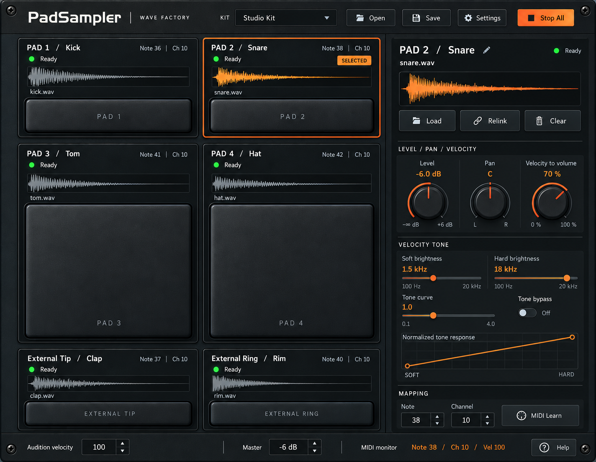
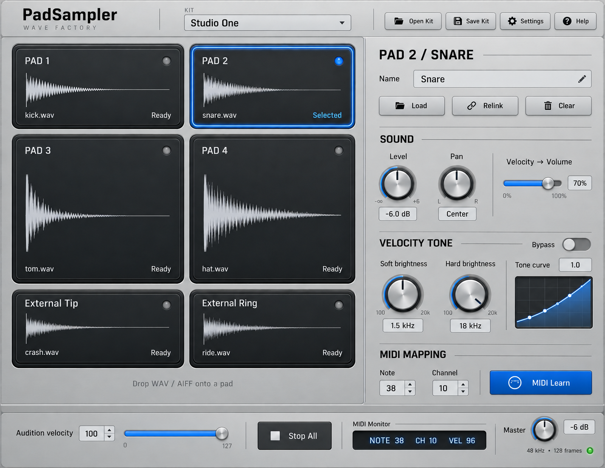
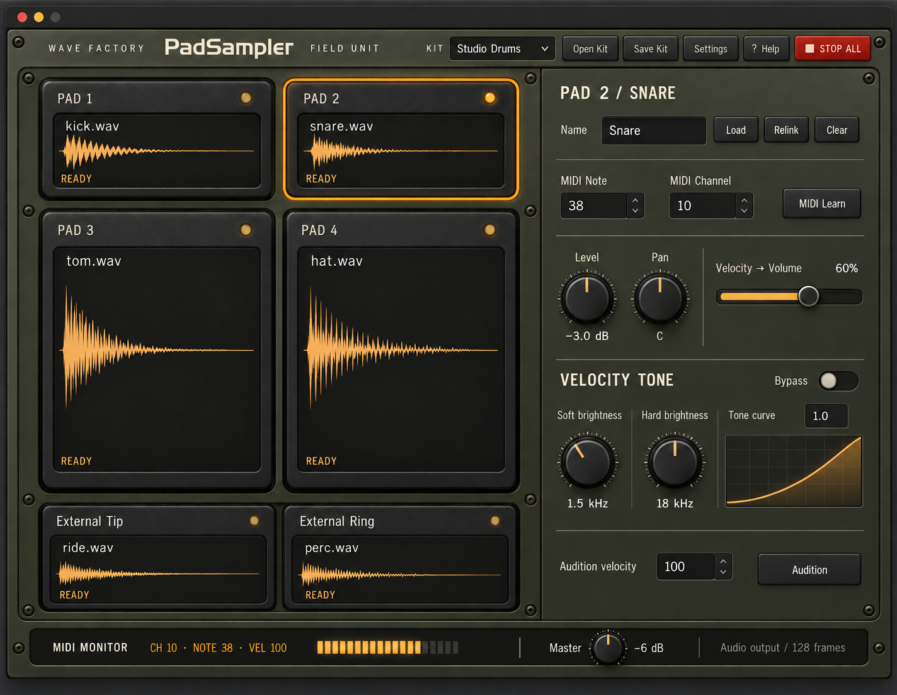

# PadSampler industrial interface concepts

Three independent design agents explored the owner's requested industrial hardware feel. These are generated visual concepts, not screenshots of implemented software. They retain the product scope established in [PadSampler](../../padsampler.md).

## Common interaction contract

- Six sample slots: two shallow upper pads, two larger lower pads, then External Tip and External Ring. Each slot remains a drop target with a file-picker alternative.
- Persistent selection is visually distinct from the brief velocity-responsive hit flash. Selection, loading, missing-file and error states also use text/icons, not color alone.
- A selected-slot inspector holds editable name, Load / Relink, Clear, MIDI Learn, note/channel, Level, Pan, Velocity Volume, Soft Brightness, Hard Brightness, Tone Curve and Tone Bypass.
- Global controls retain Open Kit, Save Kit, Stop All, audition velocity, master level, Help and standalone audio/MIDI settings. Plugin mode uses host audio/MIDI routing.
- Brightness controls describe low-pass cutoff. Soft 1.5 kHz / hard 18 kHz / curve 1.0 are example settings, not an additional processing stage. Loudness remains separately adjustable.
- Example MIDI notes, channels, filenames and monitor values are illustrative; physical mappings remain learned, not hardware claims.

## Implementation direction shared by all concepts

Reuse existing iPlug2 controls, parameter/state bindings, file dialogs and pad drop handlers. Apply material artwork and custom drawing only where it communicates tactile pads, knobs and enclosure surfaces. Do not introduce a second UI toolkit or alter DSP for visual exploration.

At the real 980×760 editor size, keep control labels and values readable, use sufficiently large targets, and reserve a clear status row for errors. Hardware texture must sit behind text, never reduce its contrast. Show a visible keyboard focus state and preserve numeric editing. Expose reduced motion through an appropriate available platform/framework mechanism; hit indication needs a static alternative.

Before implementation, choose a direction, then resolve exact typography, pixel geometry and control behavior. Validate empty, loading, ready, missing/relink, decode failure, duplicate mapping, MIDI Learn waiting/captured, selected/hit, bypass and Help states in the actual renderer. Mockups alone do not verify these states or accessibility.

## Three directions

| Concept | Materials and palette | Design strength | Refinement priority |
| --- | --- | --- | --- |
| Foundry | Charcoal powder-coated steel, rubber, orange accents | Strong industrial identity and tactile controls | Keep upper pads shallow; give performance area more space than decorative chrome |
| Precision | Satin aluminum, graphite, cobalt blue | Clear separation of performance and editing; bright labels | Reduce small dial text and ensure blue remains an accent |
| Field Unit | Muted olive-gray, black rubber, amber, cream silkscreen | Cohesive rugged instrument character | Keep selected, ready and hit indications distinct |

The owner subsequently selected **Precision** and explicitly approved an editable monotonic multipoint curve editor. This supersedes the exploration-only scope below. Plotted responses and hardware assignments in these generated concepts remain illustrative; the implemented graph draws the actual response.

Generation: built-in image tool, one independent design agent per direction, followed by a targeted correction pass. Exact prompts accompany the saved images. No new dependencies or changes to the running interface are part of this exploration.

## Final concept images

Review notes: Precision and Field Unit need explicitly labelled graph axes; all concepts need production empty/error/focus states. Precision must show readiness separately from selection. External trigger display names remain editable via the selected-slot inspector. The initial agent recommendation was Foundry; the owner selected Precision. Production follows that owner decision and the expanded editable-curve plan.
