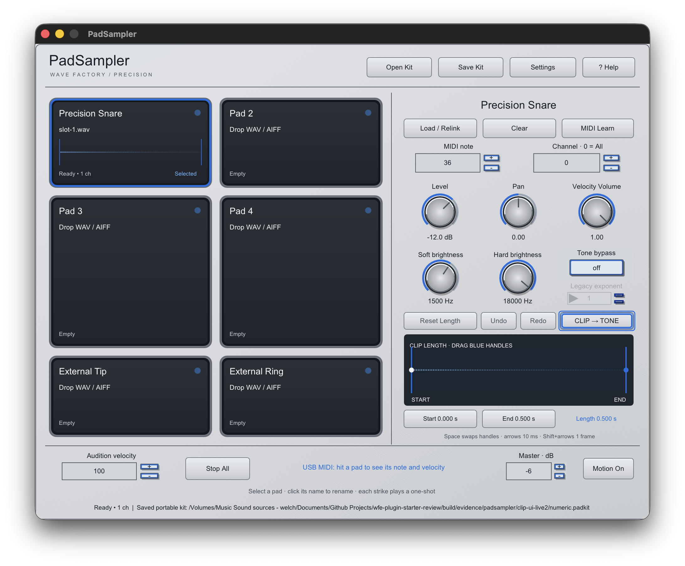
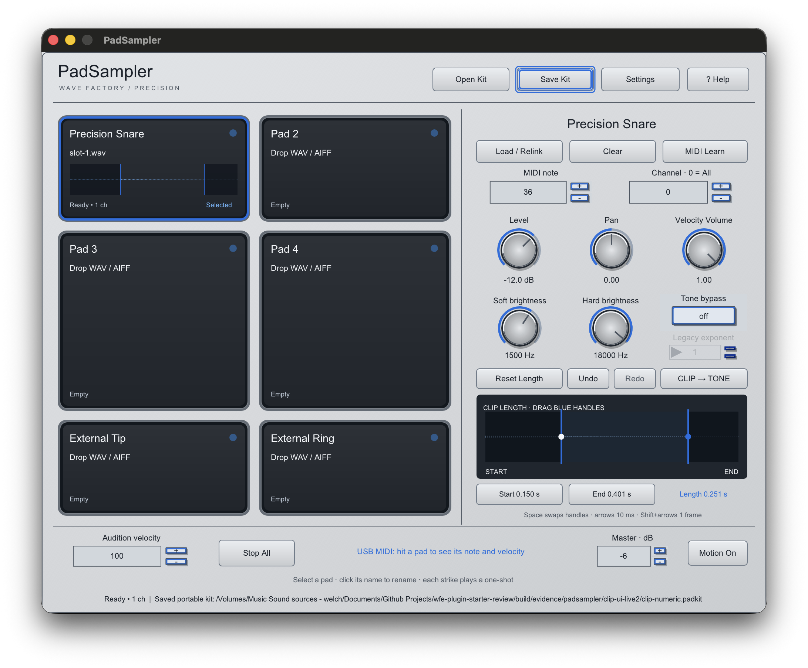
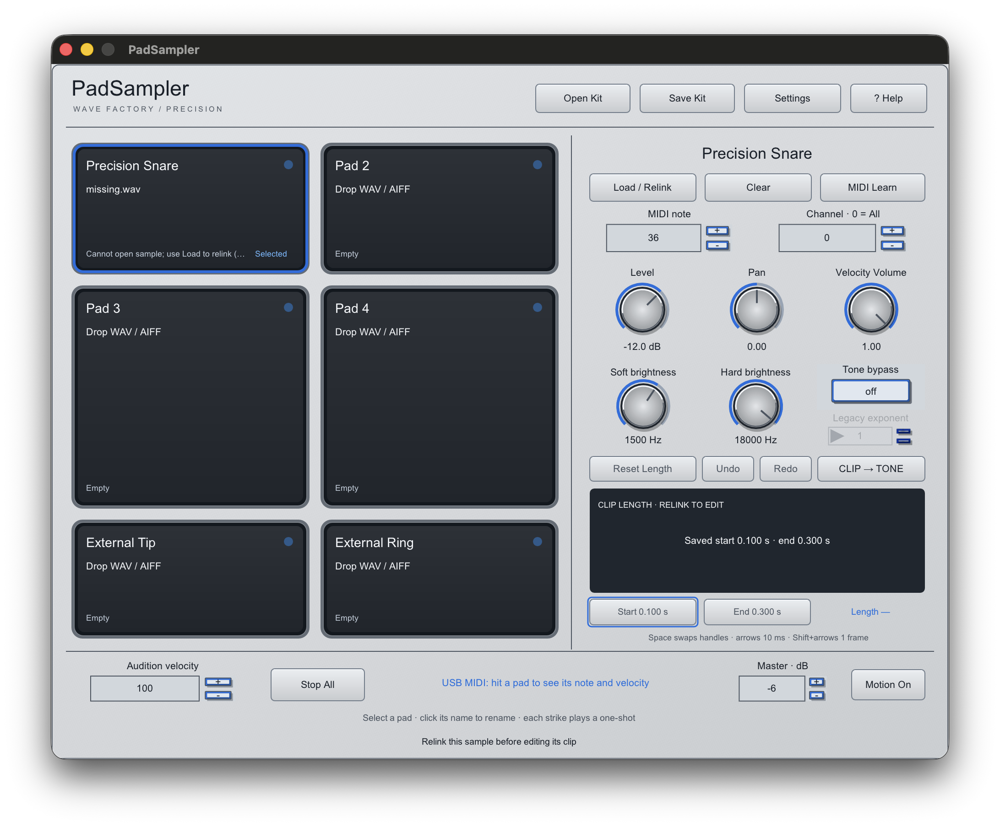

# PadSampler clip trimming verification

The selected pad's Clip mode shows the full source waveform and two frame-bounded
handles. The shaded regions do not play. The small pad waveform reflects the
same selected range.

These are direct 2× screenshots of the actual standalone renderer on September 30,
2026. They are not concept art. The dedicated native interaction harness passed
under `build/evidence/padsampler/clip-ui-live2`: tone graph regressions plus clip
start/end drag, keyboard move, numeric time entry, Reset Length, separate clip
Undo/Redo, pad switching, portable-kit recall, missing/relink and import-error states.
The missing-file screenshot additionally shows a saved 0.100–0.300 s clip with
editing disabled and a visible relink instruction.

The universal arm64/x86_64 standalone, AU and VST3 targets built. All nine CTests
passed. The sampler suite passed AddressSanitizer and UndefinedBehaviorSanitizer.
AU validation passed after one component-registration retry; pluginval 1.0.4
strictness 5 passed with editor, editor automation and state tests enabled.
The tester ZIP passed CRC, bundle signature and architecture checks. Test fixtures
and validator logs stay in ignored `build/evidence/padsampler` paths; the ad-hoc
signed tester is in ignored `dist/padsampler-clip-review`.

The portable DSP suite covers exact source-frame starts, exclusive ends, two-frame
ranges, fades, sample-rate conversion, retained ringing voices, and allocation-free
audio processing. Library tests cover version-1/2 full-length compatibility,
version-3 round trips, malformed-state rejection, immediate save, failed and
successful replacement, moved kits and too-short relink warnings.

Physical SamplePad triggering, musical listening, measured latency and Logic loaded-
sample session recall remain release acceptance. The screenshots cover the available
Retina desktop scale; a separate 1× display and plugin-editor visual inspection are
still open. Host validators open plugin editors but do not prove their visual layout.
