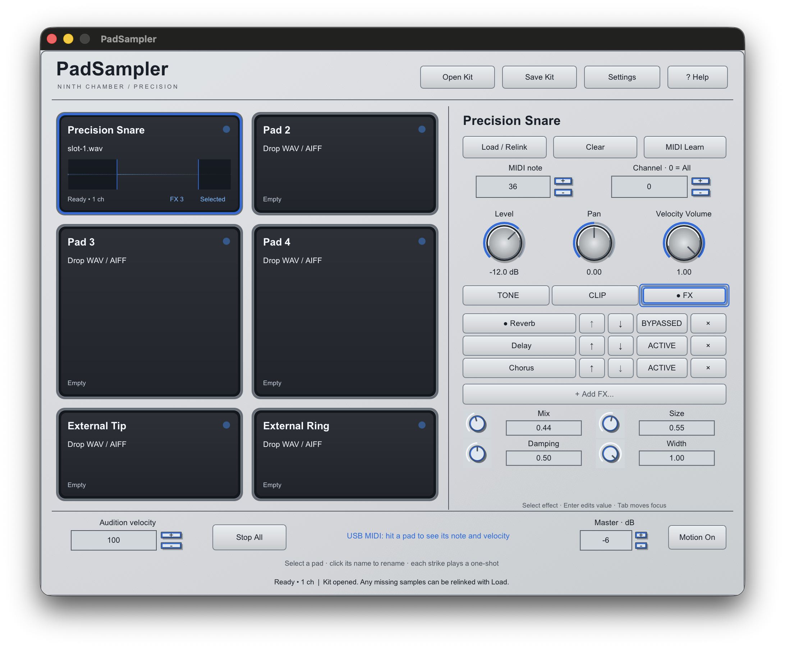
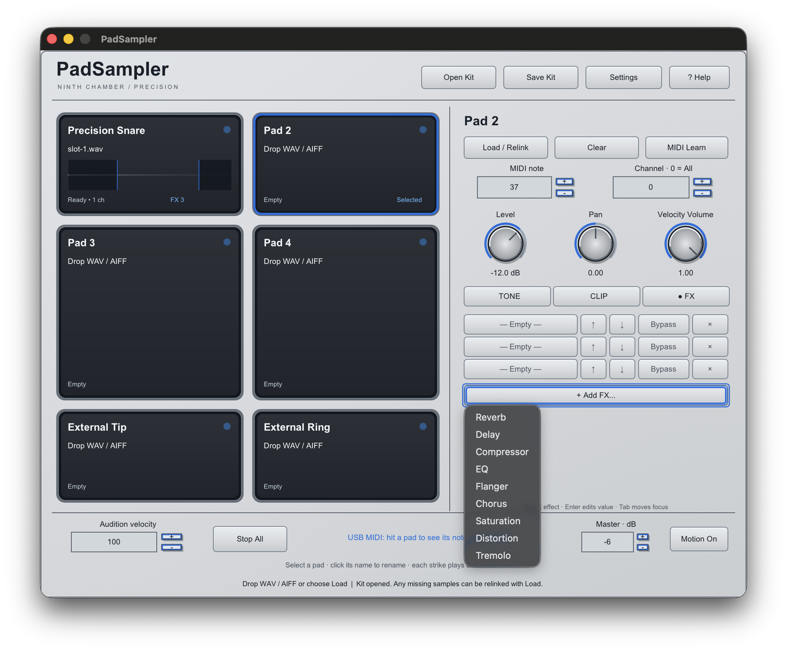
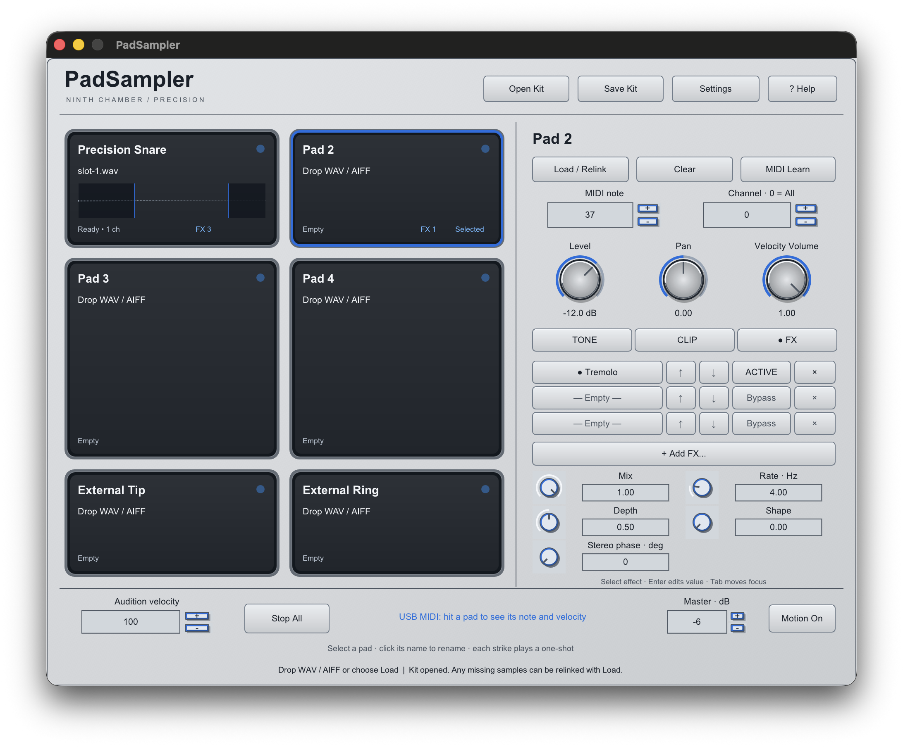

# PadSampler four-effect and Precision verification

The Precision editor now shows the PadSampler title in bold, the visible Ninth
Chamber wordmark, and a left-aligned selected-pad name in both display and rename
states. The FX inspector keeps three ordered rack positions. Its Add FX popup lists
nine distinct choices and disables types already present and all additions at the
three-effect limit. The selected effect's controls use two columns of compact
iPlug2 dials, readable labels, and editable numeric values without steppers.

These are 2× captures of the final standalone renderer on October 1, 2026,
not design mockups. The Tremolo view confirms that its fifth control clears
the helper text at the bottom of the three-row layout.

The implementation reuses iPlug2 controls, native popups, parameter bindings, and
font rendering. No new UI toolkit or runtime dependency was added. Four effects
were added to the fixed-capacity per-pad DSP: feedback-free stereo Chorus, softly
clipped Saturation, asymmetric Distortion, and shaped stereo Tremolo. Saturation
and Distortion use four-times oversampling. FX audio processing has no allocation,
locking, or filesystem access in the callback.

Version-5 kits and sessions use parameter IDs 230–355 for the new effects;
IDs 0–229 and plugin identifiers are unchanged. The v1–v4 compatibility path
restores older racks and defaults the new controls. The sampler contract suite
covers version-1 through version-5 documents, malformed and duplicate racks,
parameter bounds, per-pad isolation, chain order, each effect's signal response,
tails, Stop All, automation changes, multiple sample rates, finite output, and
audio-thread allocation tracking.

Universal arm64/x86_64 standalone, AU, and VST3 builds passed. All nine CTests
passed. The sampler suite passed AddressSanitizer and UndefinedBehaviorSanitizer.
Apple `auval -v aumu WfP6 WvFy` passed using a temporary validation install;
the temporary component was then moved to ignored local evidence storage.
pluginval 1.0.4 at strictness 5 and seed 12345 passed on the final VST3,
including editor automation, plugin state, automatable parameters, processing,
and 44.1/48/96 kHz automation at multiple buffer sizes.

The dedicated native interaction suite passed in
`build/evidence/padsampler/four-fx-native-suite-v6`. It exercised Tone and Clip
regressions, rack addition/reorder/bypass/removal, Chorus knob dragging and exact
numeric entry, Distortion on another pad, keyboard adjustment, kit recall,
malformed-kit rejection, popup selection, missing-file relink, failed import,
Help, rename, dialog cancellation, and momentary button states. The suite's
version-5 kit has 356 parameters and retains the edited Chorus setting.

The signed-for-testing universal ZIP is under ignored
`dist/padsampler-four-fx-review`. Local build, sanitizer, AU, VST3 validator,
and native UI evidence are under ignored `build/evidence/padsampler`. The native
captures use the available Retina display and are actual renderer output.
The ZIP passed CRC, bundle-signature, and architecture checks; its SHA-256 is
`22e4de1e9ff354af624ef05f1f9dd3d72f7c92ee75d48e921fab7f2720b41cf7`.

The tester remains ad-hoc signed and unnotarized. A separate 1× display check,
visual review in Logic, loaded-sample Logic session recall, physical SamplePad
performance, listening, and measured latency remain release acceptance checks.
