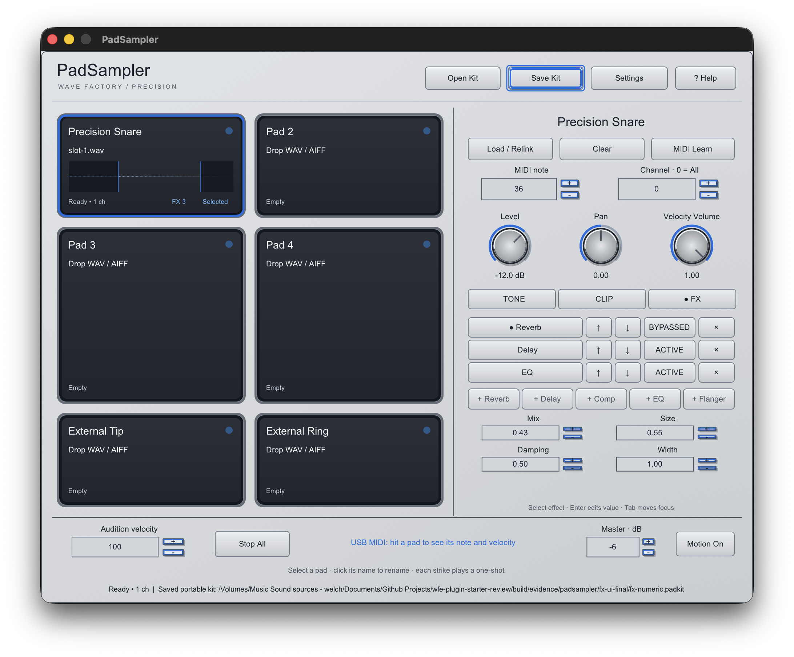
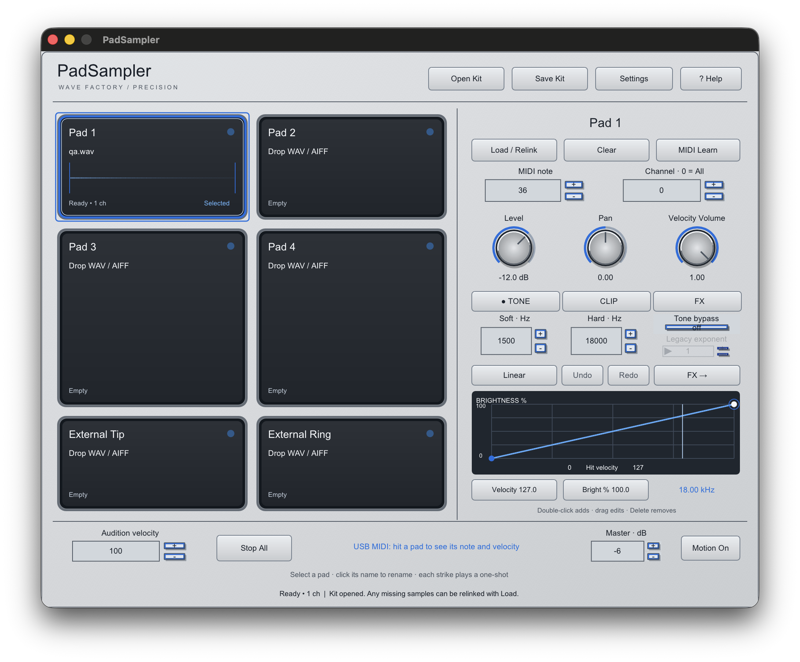

# PadSampler per-pad FX verification

The Precision FX tab shows three ordered rack positions for the selected pad.
The pad badge displays its rack count without hiding the filename, sample status,
waveform, or trim markers. These are 2× captures of the actual standalone renderer
on September 30, 2026, not mockups.

The dedicated native interaction run passed in
`build/evidence/padsampler/fx-ui-final`: tone and clip regressions; adding three
distinct effects; reordering, bypassing, removing and adding another type;
numeric and keyboard entry; per-pad isolation; portable-kit saves; missing/relink and failed
replacement states; and button, Help, focus, and keyboard checks. The FX screenshot
shows an actual 0.43 Reverb Mix entry and the saved manifest confirms parameter
ID 56. The saved v4 manifest also confirms the order `Reverb`, `Delay`, `EQ`,
Reverb bypass ID 60, and the unchanged second-pad rack.
The exact final signed app separately reopened that v4 kit and saved it again,
retaining order, clip range and Reverb Mix 0.44 after the keyboard adjustment.

Universal arm64/x86_64 standalone, AU and VST3 targets built. All nine CTests
passed, including the expanded sampler suite. The sampler suite also passed
AddressSanitizer and UndefinedBehaviorSanitizer. FX tests cover fixed parameter
IDs, topology validation, version-1 through version-4 parsing, invalid feedback,
per-pad isolation, each effect's signal response, chain order, bypass, delay and
reverb tails, Stop All, active FX without audio-thread allocation, and finite
output. Apple `auval -v aumu WfP6 WvFy` passed with a temporary validation copy
that was removed afterward. pluginval 1.0.4 at strictness 5 passed editor,
editor automation, automatable-parameter, state and processing tests.

The ad-hoc signed universal tester ZIP and SHA-256 file are in ignored
`dist/padsampler-fx-review`; its bundle signatures, architectures and ZIP CRC
were verified, including an extracted-ZIP signature/architecture check. The ZIP
SHA-256 is `f088c47683eb7c7e2d3cd7a454856d3fabb7dc128a2907862d604fb98e22e842`.
Build, sanitizer, auval, pluginval and
native UI logs/fixtures remain in ignored `build/evidence/padsampler` directories.

Reuse decision: iPlug2's existing controls, parameter bindings, host state and
SVF approach remain the interface foundation. The bundled WDL reverb and delay
were reviewed as DSP references; their resize/reset paths are unsuitable for
live audio-callback parameter changes. The built-in rack therefore uses portable,
fixed-capacity buffers with smoothed controls and bounded feedback, without a
new UI toolkit or runtime dependency.

The native captures cover the available Retina display. A separate 1× display
and visual review inside Logic remain open. pluginval exercises the plugin editor
but does not establish its visual appearance in Logic. Physical SamplePad
performance, musical listening, loaded-sample Logic recall and measured latency
remain release checks. The tester is ad-hoc signed, not notarized.
