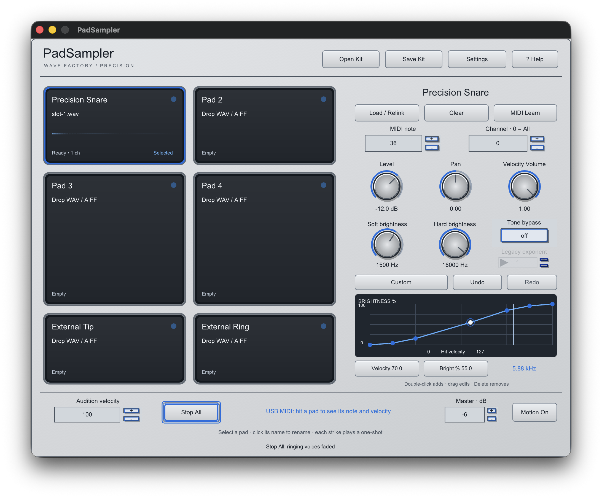
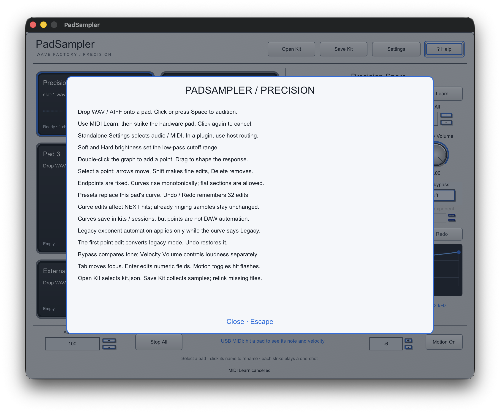

# Precision implementation verification

The owner-approved Precision interface uses the existing 980×760 iPlug2 editor,
parameter controls, dialogs and drop handling. Custom drawing supplies the enclosure,
pads and editable curve; no additional UI toolkit was introduced. Satin assets are
reproducible at 1× and 2×; labels and values remain live renderer text.



This is a screenshot of the current standalone build, not a generated concept.



## Automated evidence

- Universal arm64/x86_64 standalone, AU and VST3 build succeeds.
- All nine CTest checks pass. Curve tests cover preset values, bounds, monotonicity,
  flat sections, point limits, history limits, legacy conversion/undo, exact original
  power evaluation, per-slot isolation, whole-bank concurrent publication, allocation
  checks, unchanged ringing voices, malformed documents and portable moved kits.
- AddressSanitizer and UndefinedBehaviorSanitizer pass the sampler suite.
- Final AU passes `auval -v aumu WfP6 WvFy`.
- Final VST3 passes pluginval 1.0.4, strictness 5, seed 12345, with editor tests enabled.
  These host validators begin with empty slots; they do not prove loaded Logic recall.
- Tester packaging checks both material resources, universal architectures, signatures
  and ZIP CRC. Tester binaries are ad-hoc signed, not notarized.

Local evidence is under `build/evidence/padsampler/precision-*`. CI produces fresh
head-specific validation and tester artifacts; consult the PR checks for their status.

## Native interaction evidence and remaining checks

A dedicated final-build standalone instance passed native add/drag/delete, Undo/Redo,
bypass, per-slot isolation, native dialog cancellation, collected-kit save/recall,
name editing across idle updates, MIDI Learn waiting/cancellation and Help/Escape.
Further native assertions verified all four preset point arrays, malformed-kit
preservation, arrow movement with Shift fine adjustment and numeric velocity/brightness.
Pressed and released Stop All screenshots were inspected: the face darkens under
press, returns on release, and the footer confirms the action.

Evidence is retained across `precision-ui-regression` (gestures/recall/Help),
`precision-ui-curves-verified` (presets/malformed state/keyboard), and
`precision-ui-numeric-final` (numeric entry/button images). Some earlier automation
runs failed because native Save sheets were still closing, menu activation disrupted
tracking, or synthetic repeated keystrokes arrived too quickly. The harness now waits
for sheet dismissal, uses menu type-ahead without reactivation, and types numeric
characters with a brief delay. Exact saved-state assertions remain intact.

Native testing also found and fixed a real asynchronous NSMenu lifetime crash: the
preset control now owns its menu. An old crash-report dialog blocked subsequent input
and was initially misdiagnosed as the lock screen; it was dismissed before the verified
runs. No lock-screen bypass was attempted. The final native preset selections succeed.

The opt-in harness requires an unlocked idle desktop, Accessibility permission and a
fresh dedicated PadSampler process, since it replaces that process's kit. Never point
it at a working music session:

```sh
swiftc scripts/padsampler-ui-events.swift -o build/evidence/padsampler/ui-events
python3 scripts/test-padsampler-ui.py --pid <dedicated-app-pid> \
  --events build/evidence/padsampler/ui-events \
  --output build/evidence/padsampler/precision-ui-verified
```

Use a new output directory for each run. Build/sign before launching the process;
replacing its bundle while open can invalidate native file-dialog XPC services.

Still required: complete empty/loading/ready/missing/error/focus visual matrix in standalone and host editors at both scales,
Logic loaded-sample custom-curve session recall, physical six-trigger independence,
listening and measured latency. These remain acceptance work, not automated claims.

## Compatibility

All 56 parameter IDs and plugin identities remain unchanged. Version-1 kits/sessions
retain exact power curves and their original exponent automation until converted.
Version 2 saves six validated curve definitions, including retained legacy modes.
Older builds cannot read version-2 documents; keep original version-1 files if an
older-build fallback is needed. Curve points are non-parameter state; edits notify
host dirty state. Histories are transient and reset when kits/sessions are replaced.
